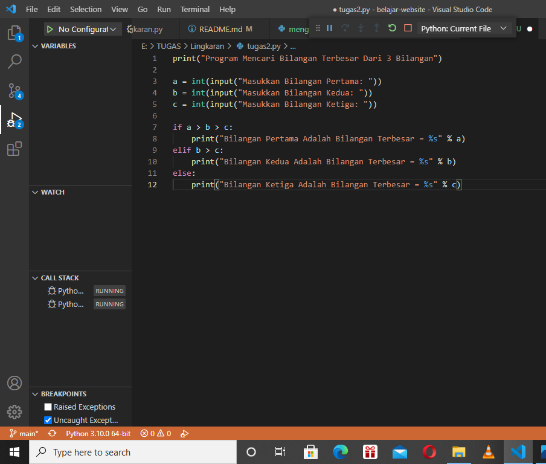
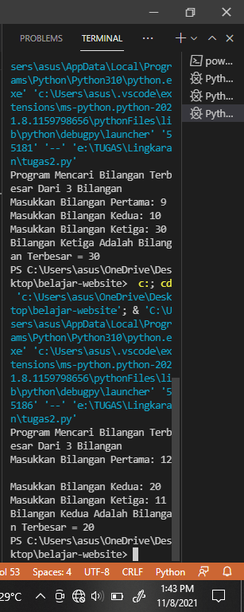
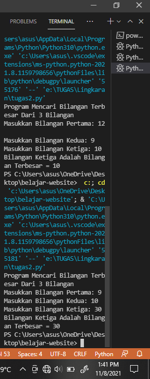

# Labspy02
## FLOWCHART
### ini adalah flowchart untuk menentukan nilai terbesar dari 3 buah bilangan

### Menggunakan satatement if untuk mencari nilai terbesar dari 3 bilangan
### programnya adalah di bawah ini

### Untuk hasil ketika program di jalankan bilangan ke 2 yang terbesar

### Untuk hasil ketika program di jalankan bilangan ke 3 yang terbesar 
